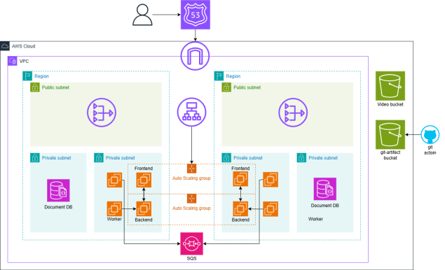
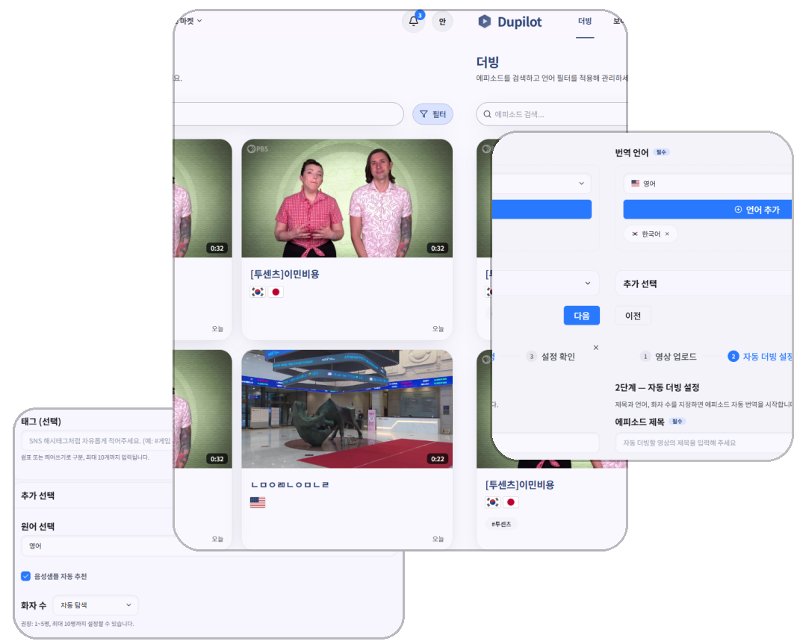
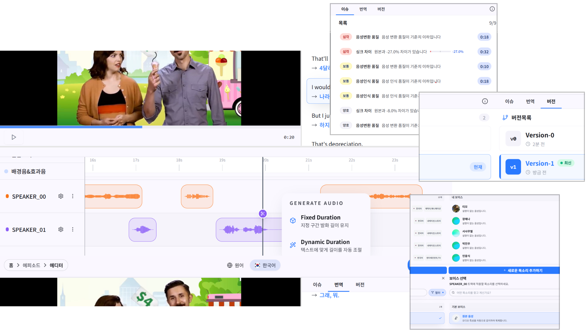
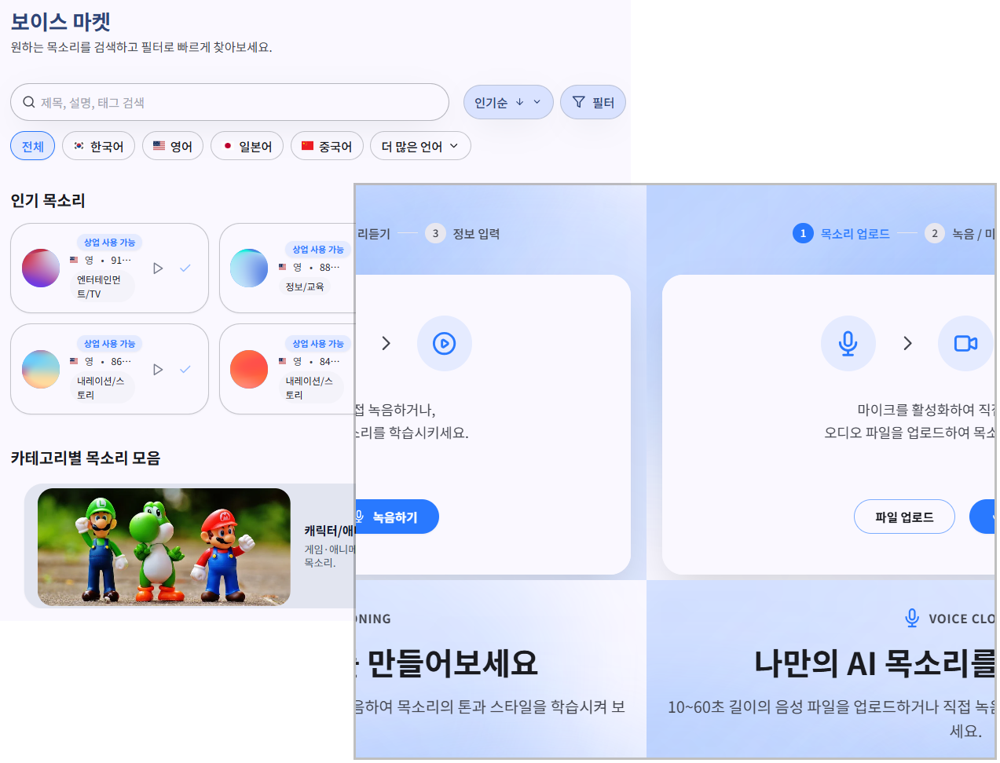

# 🎬 AI 자동 더빙 서비스 Dupilot

- 배포 URL :https://app.dupilot.store/

 

## 프로젝트 소개

- 크래프톤 정글 10기 나만의 무기 1조의 AI 자동 더빙 서비스입니다.
- 한 번의 업로드로 영상 더빙 생성 → 브라우저에서 바로 편집 → 보이스를 사고팔 수 있는 마켓까지 이어지는 워크플로우를 제공합니다.
- WhisperX STT와 CosyVoice TTS를 활용한 고품질 자동 더빙과 실시간 편집 기능을 제공합니다.

 

## 프로젝트 시연

Dupilot 서비스의 주요 기능을 담은 시연 영상입니다.  
영상 업로드부터 자동 더빙, 편집 기능까지 한눈에 확인해보세요!

 

## 팀원 구성

|                       **진주영**                       |                         **정성원**                          |                        **안준**                         |                        **김현수**                        |                       **장윤호**                        |
| :----------------------------------------------------: | :---------------------------------------------------------: | :-----------------------------------------------------: | :------------------------------------------------------: | :-----------------------------------------------------: |
|         [@jjy3385](https://github.com/jjy3385)         |      [@seongwonjung](https://github.com/seongwonjung)       |        [@anjun206](https://github.com/anjun206)         |        [@kimhyunso](https://github.com/kimhyunso)        |        [@yunojang](https://github.com/yunojang)         |
|  |  |  |  |  |

 

## 1. 기술 스택

- **Frontend**: React 18, Vite, TypeScript, TailwindCSS, Radix UI, React Query, Zustand, Zod, MSW, Vitest/Playwright
- **Backend**: FastAPI, MongoDB, boto3(S3), SQS 기반 비동기 잡 큐, Uvicorn, Docker/Compose
- **STT/TTS Worker**: WhisperX STT, CosyVoice TTS, ffmpeg 파이프라인, CUDA 기반 Docker 멀티스테이지 빌드
- **Infra/툴링**: Docker Compose(dev/prod), GitHub Actions(CI), Husky + lint-staged, Prettier/ESLint
- **버전 및 이슈관리**: Github, Github Issues
- **협업 툴**: Notion

 

## 2. 시스템 아키텍처

Dupilot 서비스는 Docker Compose 기반의 아키텍처로 구성되었습니다.  
Frontend는 React/Vite로 프로젝트 생성·목록·편집 UI와 타임라인/파형 기반 더빙 편집 기능을 제공합니다.  
Backend는 FastAPI로 인증/프로젝트/작업 API 게이트웨이 역할을 하며, MongoDB에 데이터를 저장하고 S3에 파일을 관리합니다.
SQS를 통해 STT/TTS 파이프라인을 트리거하며, STT-TTS-Worker는 WhisperX로 음성 인식 → 번역/싱크 → CosyVoice 등 TTS로 합성 → ffmpeg로 mux하여 더빙 영상/오디오를 산출합니다.  
공유 리소스는 `data/`와 `models/` 볼륨으로 입력/중간/출력/모델 캐시를 관리합니다.

 

## 3. 커밋 컨벤션

| 태그       | 설명                                                            |
| ---------- | --------------------------------------------------------------- |
| `feat`     | 새로운 기능 추가                                                |
| `fix`      | 버그 수정                                                       |
| `docs`     | 문서 수정 (README 등)                                           |
| `style`    | 코드 포맷팅, 세미콜론 누락 등 (기능 변경 없음)                  |
| `refactor` | 코드 리팩토링 (기능 변경 없음)                                  |
| `test`     | 테스트 코드 추가 및 리팩토링                                    |
| `chore`    | 빌드 설정, 패키지 매니저 등 기타 변경                           |
| `merge`    | 브랜치 병합 작업 (e.g. `feat/auth` → `develop`), 충돌 해결 포함 |

 

## 4. 역할 분담

### 🎯 진주영

- 프로젝트 전체 일정 관리 및 마일스톤 설정
- 팀원 간 작업 분배 및 우선순위 조정
- 스프린트 계획 및 진행 상황 모니터링
- 기술적 의사결정 지원 및 리스크 관리

### 🎨 정성원

- 모놀리식 파이프라인을 분산 처리 아키텍처로 리팩토링
- 서비스 간 인터페이스 표준화 및 API 통합
- 시스템 아키텍처 최적화 및 성능 개선

### 🚀 안준

- STT-TTS Worker 서비스 전체 개발 및 운영
- WhisperX 기반 음성 인식 파이프라인 구현
- CosyVoice TTS 엔진 통합
- Docker 기반 컨테이너화 및 배포 자동화

### 💻 김현수

- CI/CD 파이프라인 구축 (GitHub Actions, AWS CodeDeploy)
- Frontend 및 Backend 빌드/배포 자동화
- 코드 품질 관리 (Lint, Test, Type Check)
- 인프라 스크립트 및 배포 전략 수립

### 🔧 장윤호

- Frontend 및 Backend 핵심 기능 개발
- Redis Pub/Sub 기반 파일 업로드 진행률 추적 시스템 구현
- Server-Sent Events (SSE)를 활용한 실시간 프로젝트 진행률 모니터링
- 타임라인 기반 에디터 UI/UX 설계 및 개발 (세그먼트 편집, 파형 시각화, 멀티트랙 관리)

 

## 5. 개발 기간

- 전체 개발 기간 : 2025.10.24 ~ 2025.11.29
- 아이디어 선정 : 2025.10.24 ~ 2025.10.31
- MVP 제작 기간 : 2025.11.01 ~ 2025.11.22
- 폴리싱 : 2025.11.23 ~ 2025.11.29

 

## 6. 주요 기능

### [영상 자동 더빙]

- **자동 처리 파이프라인**: 영상/오디오 업로드 후 STT → 번역 → TTS → 오디오/영상 mux까지 자동으로 처리됩니다.
- **비동기 작업 처리**: Job 큐(SQS) 기반 비동기 처리로 대용량 파일도 안정적으로 처리합니다.
- **실시간 진행률 모니터링**: 결과 메타데이터와 파일 경로를 API로 반환하여 실시간으로 진행 상황을 확인할 수 있습니다.

  

 

### [에디터]

- **타임라인 기반 편집**: 브라우저에서 타임라인과 파형을 시각화하며 클립(세그먼트) 단위로 편집할 수 있습니다.
- **파형 시각화**: 원본 오디오와 배경 오디오의 파형을 실시간으로 확인하며 정확한 편집이 가능합니다.
- **세그먼트 편집 기능**:
  - 텍스트 수정: 원본/번역 텍스트를 직접 수정하고 즉시 반영할 수 있습니다.
  - 보이스 변경: 트랙별로 보이스를 선택하고 변경할 수 있으며, AI 추천 보이스 기능을 제공합니다.
  - 재생 속도 조절: 세그먼트별 재생 속도를 조절하여 타이밍을 미세 조정할 수 있습니다.
  - 구간 분할: 스플릿 모드를 통해 세그먼트를 분할하여 더 정밀한 편집이 가능합니다.
- **프리뷰 재생**: 원본/번역본 오디오를 전환하며 실시간으로 프리뷰할 수 있습니다.
- **멀티트랙 지원**: 화자별로 트랙을 분리하여 관리하며, 각 트랙에 독립적으로 보이스를 적용할 수 있습니다.
- **다국어 지원**: 프로젝트별로 여러 언어 버전을 생성하고 편집할 수 있습니다.
- **버전 관리**: 편집 이력을 버전별로 관리하여 이전 상태로 되돌릴 수 있습니다.
- **이슈 관리**: 번역 품질 이슈를 추적하고 관리할 수 있습니다.

 

### [보이스 마켓 & 클로닝]

- **보이스 클로닝**: 음성 파일 업로드 또는 브라우저 직접 녹음으로 나만의 AI 목소리를 생성할 수 있습니다. 약 10초 길이의 음성으로 최적화된 녹음 환경을 제공하며, 미리듣기 기능으로 품질을 검토한 후 보이스 샘플로 저장합니다.
- **보이스 샘플 라이브러리**: 다양한 보이스 샘플을 탐색하고 미리듣기할 수 있으며, 언어, 카테고리, 태그 등을 기준으로 필터링 및 검색이 가능합니다.
- **크레딧 기반 구매 시스템**: 크레딧을 사용하여 원하는 보이스를 구매하고 내 목소리에 추가할 수 있습니다.
- **트렌딩 보이스**: 인기 보이스를 한눈에 확인할 수 있는 섹션을 제공합니다.
- **권한 관리**: 보이스 샘플의 공개/비공개 설정 및 상업용/비상업용 사용 권한을 설정할 수 있습니다.
- **통합 워크플로우**: 클로닝으로 생성한 보이스 샘플은 자동으로 보이스 마켓에 등록되며, 구매한 보이스는 프로젝트에 바로 적용할 수 있습니다.

